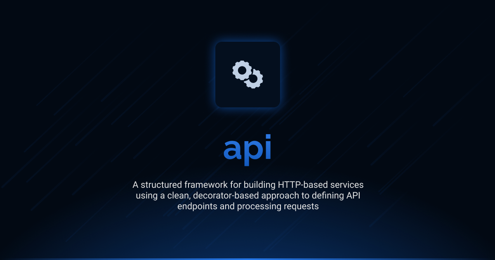

# Interface API

<div align="center">
<a href="https://www.npmjs.com/package/@antelopejs/core"></a>
<a href="https://github.com/AntelopeJS/antelopejs/blob/main/LICENSE"></a>
<a href="https://discord.gg/C2G8QW63"></a>
<a href="https://discord.gg/C2G8QW63"></a>
</div>

A powerful, decorator-based framework for building HTTP services with TypeScript. Interface API simplifies the process of defining routes, handling requests, and generating responses using a clean, declarative syntax.

## Installation

```bash
ajs module imports add api@beta
```

## Documentation

Detailed documentation is available in the `docs` directory:

- [Introduction](./docs/1.introduction.md) - Overview and basic concepts
- [Controllers](./docs/2.controllers.md) - Creating and using API controllers
- [HTTP Handling](./docs/3.http-handling.md) - Request and response handling
- [Parameter Handling](./docs/4.parameters.md) - Working with parameters

## Current Status

This is the development version (`beta`) of the Interface API. It is currently in pre-release stage and may undergo changes before the final release. The interface is not considered stable for production use without understanding that breaking changes may occur.

## Versions

| Version | Link                                                                              | Status                                        |
| ------- | --------------------------------------------------------------------------------- | --------------------------------------------- |
| beta    | [api@beta](https://github.com/AntelopeJS/api/tree/main/.antelope/output/api/beta) | Waiting validation from community to go in v1 |
| 1       | _Not yet released_                                                                | Planned stable release                        |

## License

This project is licensed under the Apache License 2.0 - see the [LICENSE](LICENSE) file for details.
