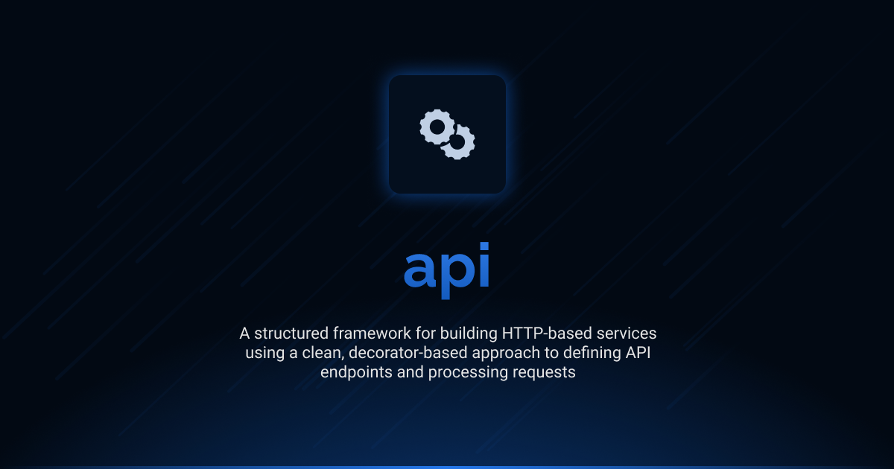

# Interface API

<div align="center">
<a href="https://www.npmjs.com/package/@antelopejs/interface-api"></a>
<a href="./LICENSE"></a>
<a href="https://discord.gg/sjK28QHrA7"></a>
<a href="./docs/1.introduction.md"></a>
</div>

A decorator-based framework for building HTTP services with TypeScript. Interface API provides a clean, declarative syntax for defining routes, handling requests, managing responses, and supporting WebSocket connections.

## Installation

```bash
npm install @antelopejs/interface-api
```

## Documentation

Detailed documentation is available in the `docs` directory:

- [Introduction](./docs/1.introduction.md) - Overview and core concepts
- [Controllers](./docs/2.controllers.md) - Creating and organizing API controllers
- [HTTP Handling](./docs/3.http-handling.md) - Request and response handling
- [Parameter Handling](./docs/4.parameters.md) - Parameter injection and transformation

## License

This project is licensed under the Apache License 2.0 - see the [LICENSE](LICENSE) file for details.
